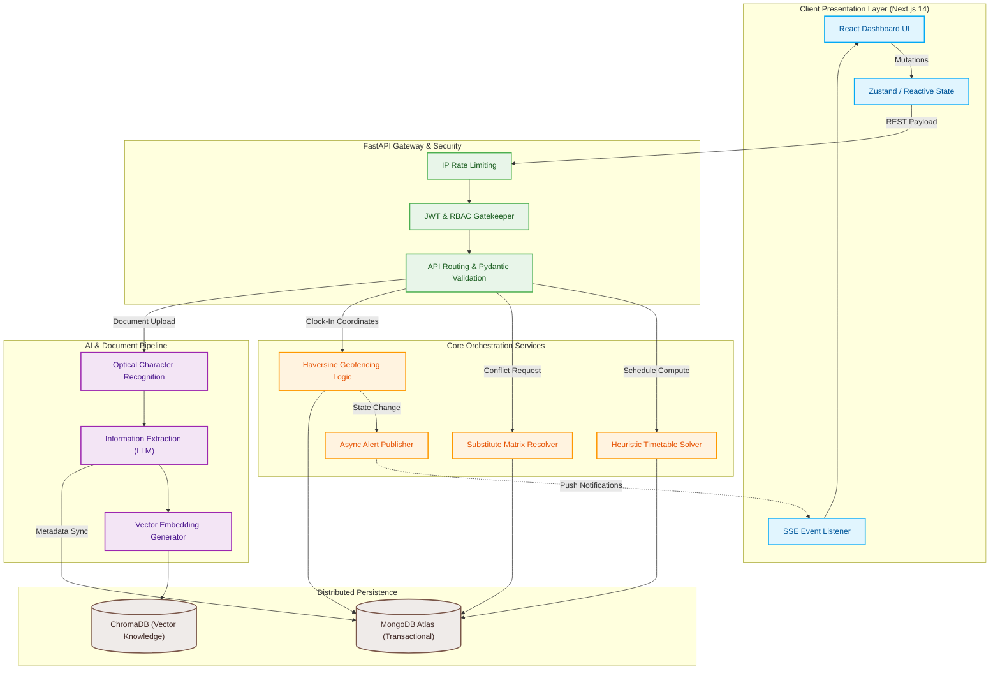

<div align="center">


# CampusNova — Future-Ready Operations Command Center

### The calm control center for your entire campus. Built for modern institutional operations, AI-assisted workflows, constraint-solved timetables, and live substitute routing.

<p align="center">
  
  &nbsp;&nbsp;&nbsp;
  
  &nbsp;&nbsp;&nbsp;
  
  &nbsp;&nbsp;&nbsp;
  
  &nbsp;&nbsp;&nbsp;
  
  &nbsp;&nbsp;&nbsp;
  
</p>

<br />

<a href="https://campus-nova-sand.vercel.app/login" target="_blank">
  <h2>Try It Live &rarr;</h2>
</a>

**[Backend API Service (FastAPI & Render)](https://campusnova-api.onrender.com)** &nbsp;|&nbsp; **[Interactive API Documentation (Swagger UI)](https://campusnova-api.onrender.com/docs)**

</div>

---

## Table of Contents
* [Platform Dashboard](#platform-dashboard)
* [Comprehensive Hackathon & Engineering Journey](#comprehensive-hackathon--engineering-journey)
* [Deep Architecture Analysis](#deep-architecture-analysis)
* [Advanced Architectural Deep-Dive & Mathematical Models](#advanced-architectural-deep-dive--mathematical-models)
* [Exhaustive API Endpoints Specification Matrix](#exhaustive-api-endpoints-specification-matrix)
* [Feature Showcase](#feature-showcase)
* [Performance, Security, and Edge-Case Mitigations](#performance-security-and-edge-case-mitigations)
* [Repository Structure](#repository-structure)
* [Setup & Installation](#setup--installation)
* [Future Roadmap & Enterprise Scalability](#future-roadmap--enterprise-scalability)

---

## Platform Dashboard


---

## Comprehensive Hackathon & Engineering Journey

### Genesis of CampusNova
CampusNova was engineered specifically to tackle the **Future-Ready Ops Innovation Challenge**. Extensive preliminary research into institutional workflows revealed extreme inefficiencies stemming from a reliance on manual data entry, physical document storage, and siloed scheduling systems. The core bottlenecks identified included:
*   **Timetabling Clashes:** Manually resolving double-booked faculty and room overlaps required hundreds of administrative hours per semester.
*   **Delayed Substitute Tracking:** Sudden faculty absences led to chaotic, reactionary reassignments, often resulting in unsupervised classrooms.
*   **Attendance Friction:** Legacy attendance ledgers were prone to human error, proxy attendance (spoofing), and delayed reporting to stakeholders.

### Iterative Development and Architectural Pivots
Our engineering journey was defined by rapid iteration and crucial architectural pivots necessary to build a truly production-grade system within the hackathon timeframe. 

Initially, we explored utilizing Large Language Models (LLMs) to dynamically generate timetables by feeding schedule matrices directly into the prompt context. However, rigorous testing quickly exposed severe hallucination risks—the LLM would occasionally assign teachers to multiple rooms simultaneously or violate mandatory credit-hour constraints. 

To ensure absolute system integrity, we pivoted. We decoupled the architecture, implementing a deterministic Constraint Programming model (utilizing heuristic algorithms and CP-SAT logic) for all critical scheduling operations. The LLM integration was subsequently restricted to tasks it inherently excels at: parsing unstructured data (Optical Character Recognition on leave forms) and semantic retrieval (Retrieval-Augmented Generation for institutional policy queries). This pivot transformed CampusNova from an experimental concept into a mathematically sound, explainable, and highly reliable enterprise platform.

---

## Deep Architecture Analysis

Our system isolates state mutation, machine learning inference, and asynchronous job queues into discrete functional blocks. This guarantees that complex computational operations do not block the primary HTTP event loop.



---

## Advanced Architectural Deep-Dive & Mathematical Models

### Constraint-Solving Matrix
The backbone of CampusNova's scheduling capability is a mathematically rigorous constraint-solving matrix. We modeled the institutional timetable as a complex optimization problem.

*   **Hard Constraints:** Absolute rules that cannot be violated under any circumstance. Examples include ensuring a single teacher is never assigned to two distinct classes during the same time block, and guaranteeing room capacity strictly exceeds enrolled student count.
*   **Soft Constraints:** Preferences that the algorithm attempts to optimize but can override if a valid solution requires it. Examples include minimizing gaps in a teacher's daily schedule or preferring specific room types for particular subjects.
*   **Optimization Strategy:** The heuristic solver explores the matrix domain space, applying constraint propagation to prune invalid branches instantly, rapidly converging on a conflict-free global timetable.

### Substitute Resolver Logic
When an instructor is marked absent, the resolver queries the active daily matrix. It computes candidate availability based on real-time schedule gaps, ranks them by subject matter expertise (matching taxonomy tags between the absent teacher and the candidate pool), and evaluates hierarchical roles to propose the most logical, least disruptive substitute assignment.

### Retrieval-Augmented Generation (RAG) Pipeline
The institutional knowledge base operates on a localized RAG pipeline.
*   **Embedding Strategy:** Documents and policy guidelines are ingested, chunked, and vectorized using `all-MiniLM-L6-v2`.
*   **Vector Search Mechanics:** High-dimensional vectors are stored in ChromaDB. When an administrator queries the AI Command interface, the system performs a cosine similarity search to retrieve the most semantically relevant text chunks.
*   **Synthesis:** The retrieved context is passed alongside the user's query to the LLM, effectively grounding the generative response in verified institutional policy and eliminating hallucinations.

### Haversine Geofencing
Faculty attendance utilizes the Haversine formula to compute the great-circle distance between the user's reported GPS coordinates and the institution's predefined geographical centroid. Distances exceeding the allowed radius instantly flag the clock-in attempt as an anomaly.

---

## Exhaustive API Endpoints Specification Matrix

The backend exposes a highly structured, RESTful API. Every endpoint is shielded by strict Pydantic validation schemas. 

| HTTP Method | Endpoint Path | Access Role (RBAC) | Brief Description |
|---|---|---|---|
| **POST** | `/api/v1/auth/login` | Public | Authenticates credentials and issues cryptographically signed JWT access tokens. |
| **POST** | `/api/v1/auth/register` | Admin | Provisions new user accounts with designated role assignments. |
| **GET** | `/api/v1/admin/erp/summary` | Admin | Aggregates high-level metrics for the primary dashboard operations. |
| **GET** | `/api/v1/portals/teacher/my-classes` | Faculty | Retrieves the daily schedule specific to the authenticated instructor. |
| **GET** | `/api/v1/portals/student/my-schedule` | Student | Retrieves the conflict-free timetable tailored to the student's enrollments. |
| **POST** | `/api/v1/attendance/clock-in` | Faculty | Validates incoming GPS coordinates via Haversine logic to record attendance. |
| **POST** | `/api/v1/attendance/bulk-sync` | Admin | Synchronizes offline or bulk attendance ledgers with the primary database. |
| **POST** | `/api/v1/resources/resolve-conflict` | Admin | Triggers the heuristic algorithm to compute optimal substitute faculty routing. |
| **POST** | `/api/v1/documents/upload` | Authenticated | Ingests physical forms into the asynchronous OCR processing pipeline. |
| **GET** | `/api/v1/documents/queue` | Admin | Fetches pending administrative documents requiring manual approval. |
| **POST** | `/api/v1/knowledge/query` | Authenticated | Executes a semantic vector search against ChromaDB for policy retrieval. |
| **GET** | `/api/v1/transport/fleet-status` | Admin | Aggregates live geographical data for institutional transport fleets. |

---

## Feature Showcase

### 1. Centralized Command Dashboard
A modular interface designed strictly for minimal clicks. Operations such as substitute teacher assignment, attendance tracking, and schedule conflict resolution are surfaced proactively. 


### 2. Timetable Generation & Management
Automated conflict resolution allows administrators to generate semester timetables in seconds.


### 3. Faculty Attendance & Geofencing
Secure, location-aware faculty check-ins complete with spoofing detection and real-time dashboard updates.


### 4. AI Document Processing
Physical leave requests or administrative forms uploaded to the system are processed asynchronously. Optical character recognition extracts the critical metadata and routes it to the appropriate administrative queue.


### 5. Institutional Knowledge Base
A centralized repository powered by ChromaDB for querying institutional policies, procedures, and historical data.


### 6. Transport & Fleet Operations
Live tracking and predictive metrics for institutional transport fleets.


### 7. AI Command Interface
Natural language processing interface allowing administrators to query system data conversationally.


### 8. User Identity Management
Hierarchical, role-based access control interfaces.


---

## Performance, Security, and Edge-Case Mitigations

### Resilience & Fault Tolerance
*   **SSE Reconnection Logic:** The Server-Sent Events stream, providing real-time alerts to the dashboard, implements exponential backoff. If the client disconnects due to network instability, the interface transparently attempts to reconnect without requiring a page refresh.
*   **Optimistic UI Updates:** For critical path operations (such as resolving a schedule conflict), the Next.js frontend updates local state immediately, masking network latency and delivering an instantaneous, frictionless user experience.

### Security Architecture
*   **Insecure Direct Object Reference (IDOR) Prevention:** Standard web vulnerabilities are mitigated by ensuring all bulk operations and data queries strictly map to the identity embedded within the validated JWT token. Cross-tenant access is cryptographically blocked at the routing layer.
*   **Strict Payload Parsing:** Every incoming API request passes through a Pydantic boundary. Payloads failing type-checks, missing required fields, or exceeding string length constraints are instantly rejected with HTTP 422 before ever reaching core business logic.
*   **Rate Limiting Layers:** Utilizing IP-based request throttling on sensitive endpoints (such as `/auth/login` and `/documents/upload`) shields the backend architecture from brute-force password attacks and malicious Denial-of-Service vectors.
*   **Token Revocation & Expiry:** Short-lived access tokens limit the attack surface in the event of local device compromise. 

---

## Repository Structure

Our codebase is organized into a scalable, professional enterprise tier system.

```text
CampusNova/
├── backend/
│   ├── app/                # Core FastAPI application (routing, models, services)
│   ├── tests/              # Pytest suites ensuring endpoint reliability
│   ├── requirements.txt    # Python dependencies
│   └── Dockerfile          # Containerization for consistent environments
├── frontend/
│   ├── app/                # Next.js 14 App Router (pages and layouts)
│   ├── components/         # Reusable React UI widgets
│   └── lib/                # API clients, state management, and utilities
├── docs/                   # Architecture diagrams and technical specifications
├── scripts/                # Database seeding and automation scripts
└── docker-compose.yml      # Local development container orchestration
```

---

## Setup & Installation

### Prerequisites
*   Node.js 20+
*   Python 3.11+
*   MongoDB Instance
*   Docker & Docker Compose (Optional for containerized execution)

### Backend Initialization
```bash
# Navigate to the backend service
cd backend

# Install dependencies
pip install -r requirements.txt

# Configure your local .env file
cp .env.example .env

# Launch the FastAPI server
uvicorn app.main:app --reload --host 0.0.0.0 --port 8000
```

### Database Seeding
Execute the automation scripts from the project root to populate initial administrative accounts and demo data:
```bash
python scripts/seed_admin.py
python scripts/seed_demo_data.py
```

### Frontend Initialization
```bash
# Navigate to the frontend interface
cd frontend

# Install packages
npm install

# Start the Next.js development server
npm run dev
```

---

## Future Roadmap & Enterprise Scalability

While the current architecture delivers a highly resilient, production-ready Minimum Viable Product (MVP), our strategic roadmap anticipates significant scale.

*   **Kubernetes Horizontal Pod Autoscaling (HPA):** Transitioning from Docker Compose to managed Kubernetes clusters. This will enable the automatic scaling of the FastAPI pods in response to CPU utilization spikes during morning attendance rushes.
*   **Distributed Caching Layer:** Integrating Redis to cache high-frequency read requests (e.g., the primary dashboard summary). This will drastically reduce MongoDB query volume and drive latency down to sub-millisecond ranges.
*   **Asynchronous Message Brokers:** Implementing Celery backed by RabbitMQ to completely decouple the AI OCR processing from the primary ASGI thread, allowing the backend to ingest massive batches of physical forms without degrading API response times.
*   **Multi-Tenant Database Sharding:** As deployment expands across distinct institutional campuses, MongoDB collections will be sharded based on tenant IDs, ensuring data isolation and limitless horizontal scalability.

---

<br/>

<div align="center">
  <p>Made with Care by <b>Team Haigure</b></p>
</div>
