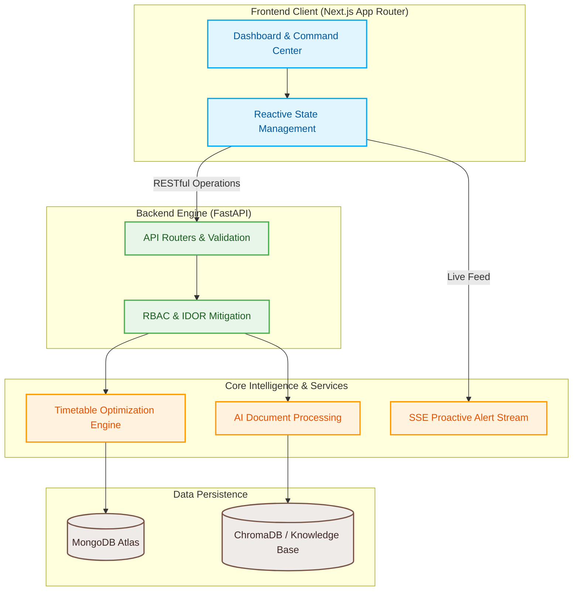

<div align="center">


# CampusNova — Future-Ready Operations Command Center

### The calm control center for your entire campus. Built for modern institutional operations, AI-assisted workflows, constraint-solved timetables, and live substitute routing.

[](https://nextjs.org/)
[](https://fastapi.tiangolo.com/)
[](https://www.mongodb.com/)
[](https://www.trychroma.com/)
[](https://vercel.com/)
[](https://render.com/)

</div>

---

## Table of Contents
* [Quick Highlights](#quick-highlights)
* [Live Production Deployment](#live-production-deployment)
* [Platform Dashboard](#platform-dashboard)
* [Project Philosophy & Innovation Challenge](#project-philosophy--innovation-challenge)
* [Core Engines & Mathematical Models](#core-engines--mathematical-models)
* [System Architecture & Data Flow](#system-architecture--data-flow)
* [Repository Structure](#repository-structure)
* [Feature Showcase](#feature-showcase)
* [Design Decisions](#design-decisions)
* [Hackathon Engineering Journey](#hackathon-engineering-journey)
* [Lessons Learned & Challenges](#lessons-learned--challenges)
* [API Reference](#api-reference)
* [Security & Reliability](#security--reliability)
* [Setup & Installation](#setup--installation)
* [Future Roadmap](#future-roadmap)

---

## Quick Highlights

*   **Deterministic Optimization Engine:** Keeps timetable and substitute routing logic strictly mathematical to ensure deterministic, conflict-free scheduling without AI hallucination risks.
*   **Minimal-Click Admin Dashboard:** A centralized command center featuring proactive alerts for operational bottlenecks rather than forcing administrators to hunt for data.
*   **Asynchronous AI Document Processing:** Automated extraction and validation of physical forms, leave requests, and administrative records using Optical Character Recognition (OCR) and Natural Language Processing.
*   **Real-Time State Synchronization:** Robust reactive state management ensures UI components remain perfectly synchronized across the dashboard when live substitutions or timetable shifts occur via Server-Sent Events (SSE).
*   **Geofence & Spoof Mitigation:** Secure IP logging and geographical spoofing flags on faculty clock-ins guarantee audit trail integrity.

---

## Live Production Deployment

*   **Frontend Application (Next.js & Vercel):** [CampusNova Frontend](https://campus-nova-sand.vercel.app/login)
*   **Backend API Service (FastAPI & Render):** [CampusNova Backend API](https://campusnova-api.onrender.com)
*   **Interactive API Documentation:** [Swagger UI Docs](https://campusnova-api.onrender.com/docs)

---

## Platform Dashboard


---

## Project Philosophy & Innovation Challenge

CampusNova was engineered specifically to tackle the **Future-Ready Ops Innovation Challenge**. School administration currently remains heavily reliant on manual data entry, physical document storage, and siloed scheduling systems, leading to extreme institutional inefficiencies. 

Our solution is built to be evaluated on three core pillars:
1.  **Innovation & Impact:** We creatively approached traditional workflows by replacing multiple legacy applications with a single, centralized data flow. The platform solves real-world bottlenecks in education and institutional productivity.
2.  **Technical Execution:** We prioritized high code quality, modular architecture, and scalable logic. The system leverages modern state management, containerized deployment, and clean backend API integrations.
3.  **UI / UX Design:** We delivered a seamless, accessible, and highly responsive user experience. The application goes beyond functional correctness—it feels intuitive, calm, and predictive for end-users.

---

## Core Engines & Mathematical Models

At the core of CampusNova is a deterministic solver engine that computes resource allocation without relying on non-deterministic LLMs.

### Timetable Optimization Engine
Rather than relying on manual drag-and-drop interfaces, our heuristic algorithms compute conflict-free timetables by balancing teacher availability, room capacity, and subject requirements. The solver utilizes constraint propagation to ensure that no single faculty member is double-booked and that mandatory credit hours are fulfilled.

### Substitute Routing & Resolution
When an instructor is marked absent, the optimization algorithms instantly query the current day's matrix, calculate availability, and rank substitute candidates based on subject matter expertise, hierarchical roles, and schedule gaps.

---

## System Architecture & Data Flow



---

## Repository Structure

Our codebase is organized into a scalable, professional enterprise tier system.

```text
CampusNova/
├── backend/
│   ├── app/                # Core FastAPI application (routing, models, services)
│   ├── tests/              # Pytest suites ensuring endpoint reliability
│   ├── requirements.txt    # Python dependencies
│   └── Dockerfile          # Containerization for consistent environments
├── frontend/
│   ├── app/                # Next.js 14 App Router (pages and layouts)
│   ├── components/         # Reusable React UI widgets
│   └── lib/                # API clients, state management, and utilities
├── docs/                   # Architecture diagrams and technical specifications
├── scripts/                # Database seeding and automation scripts
└── docker-compose.yml      # Local development container orchestration
```

---

## Feature Showcase

### 1. Centralized Command Dashboard
A modular interface designed strictly for minimal clicks. Operations such as substitute teacher assignment, attendance tracking, and schedule conflict resolution are surfaced proactively. 


### 2. Timetable Generation & Management
Automated conflict resolution allows administrators to generate semester timetables in seconds.


### 3. Faculty Attendance & Geofencing
Secure, location-aware faculty check-ins complete with spoofing detection and real-time dashboard updates.


### 4. AI Document Processing
Physical leave requests or administrative forms uploaded to the system are processed asynchronously. Optical character recognition extracts the critical metadata and routes it to the appropriate administrative queue.


### 5. Institutional Knowledge Base
A centralized repository powered by ChromaDB for querying institutional policies, procedures, and historical data.


### 6. Transport & Fleet Operations
Live tracking and predictive metrics for institutional transport fleets.


### 7. AI Command Interface
Natural language processing interface allowing administrators to query system data conversationally.


### 8. User Identity Management
Hierarchical, role-based access control interfaces.


---

## Design Decisions

*   **FastAPI Backend:** We selected FastAPI because of its native ASGI concurrency and fast Pydantic schema validation. This allows us to process multi-source telemetry, OCR tasks, and constraint-solving computations efficiently.
*   **MongoDB Atlas:** We needed a flexible document model to handle varying schedule matrices, dynamic document metadata, and user profiles without the rigid overhead of relational migrations.
*   **Separating Rules from AI:** We chose to keep core scheduling and substitute routing deterministic (written in Python) because letting an LLM calculate shift matrices introduces severe hallucination risks. The AI is restricted to NLP parsing, OCR extraction, and conversational querying.
*   **Next.js App Router:** Utilized for its robust server-side rendering capabilities, optimizing initial payload delivery while maintaining dynamic client-side interactions via Framer Motion.

---

## Hackathon Engineering Journey

We originally designed the scheduling module to compile prompt details and let the LLM directly output the timetable. However, early tests during the hackathon demonstrated that prompt engineering alone could not prevent hallucinations in complex, multi-variable matrix operations. 

We pivoted to a decoupled model: we wrote structured heuristic algorithms to calculate the schedules first, and only utilized AI for tasks it inherently excels at—such as extracting unstructured data from physical leave forms. This transition made the system explainable, deterministic, and exponentially faster.

---

## Lessons Learned & Challenges

*   **Deterministic Gating:** High-stakes institutional applications require deterministic boundaries. Mixing AI with strict operational rules is best executed by utilizing code for calculations and AI exclusively for rendering or extracting unstructured data.
*   **Real-Time Synchronization:** Building the Server-Sent Events (SSE) pipeline required strict memory management to prevent memory leaks during client disconnects.
*   **IDOR Vulnerability Mitigation:** Securing endpoints against Insecure Direct Object Reference (IDOR) attacks required complex validation logic mapping JWT tokens strictly to domain profiles across all bulk operations.

---

## API Reference

The backend exposes a highly structured REST API. Below are key module groupings. You can interactively test these at `https://campusnova-api.onrender.com/docs`.

| Endpoint Group | Primary Function | Security Boundary |
|---|---|---|
| `POST /api/v1/auth/*` | JWT Token Issuance & Registration | Public |
| `GET /api/v1/admin/erp/*` | Core Dashboard Metrics & State | Admin Only |
| `POST /api/v1/attendance/*` | Geofenced Clock-in & Bulk Sync | Admin / Faculty |
| `POST /api/v1/resources/resolve-conflict` | Algorithmic Substitute Routing | Admin Only |
| `POST /api/v1/documents/*` | AI OCR Upload & Approval Pipeline | Authenticated |
| `GET /api/v1/portals/*` | Faculty & Student Profile Data | Authenticated |

---

## Security & Reliability

1.  **Strict Role-Based Access Control (RBAC):** Privileges are distinctly isolated between `admin`, `teacher`, and `student` roles.
2.  **Insecure Direct Object Reference (IDOR) Prevention:** Cryptographically validated tokens map directly to specific domain profiles, explicitly denying cross-tenant data access.
3.  **Input Validation:** Deep schema validation via Pydantic prevents injection attacks and guarantees safe data ingestion.
4.  **Rate Limiting:** IP-based request throttling shields the platform from denial-of-service vectors.

---

## Setup & Installation

### Prerequisites
*   Node.js 20+
*   Python 3.11+
*   MongoDB Instance
*   Docker & Docker Compose (Optional for containerized execution)

### Backend Initialization
```bash
# Navigate to the backend service
cd backend

# Install dependencies
pip install -r requirements.txt

# Configure your local .env file
cp .env.example .env

# Launch the FastAPI server
uvicorn app.main:app --reload --host 0.0.0.0 --port 8000
```

### Database Seeding
Execute the automation scripts from the project root to populate initial administrative accounts and demo data:
```bash
python scripts/seed_admin.py
python scripts/seed_demo_data.py
```

### Frontend Initialization
```bash
# Navigate to the frontend interface
cd frontend

# Install packages
npm install

# Start the Next.js development server
npm run dev
```

---

## Future Roadmap

The current architecture represents a production-ready foundation. Future extensions planned post-hackathon include:
*   **Distributed Caching:** Integrating Redis to accelerate frequent dashboard metric reads.
*   **Message Queues:** Implementing Celery or RabbitMQ to completely offload heavy OCR document processing tasks from the primary ASGI thread.
*   **Kubernetes Orchestration:** Preparing horizontal pod autoscaling configurations for large-scale institutional deployment.
*   **Advanced Analytics:** Integrating predictive models for seasonal attendance drops.
