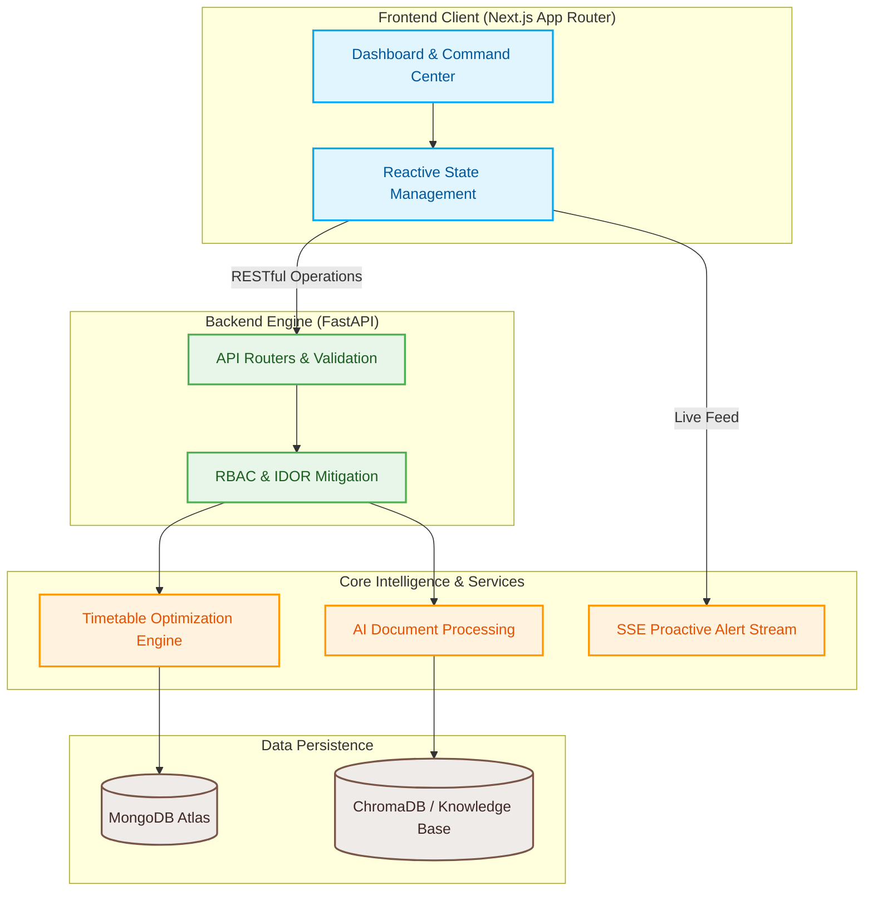

<div align="center">


# CampusNova — Future-Ready Operations Command Center

### An intelligent, AI-powered ERP solution that automates everyday school operations, digitizes physical records, and drastically reduces administrative workload through constraint-solved scheduling and real-time state synchronization.

[](https://nextjs.org/)
[](https://fastapi.tiangolo.com/)
[](https://www.mongodb.com/)
[](https://www.trychroma.com/)
[](https://vercel.com/)
[](https://render.com/)

</div>

---

## Table of Contents
* [Quick Highlights](#quick-highlights)
* [Live Production Deployment](#live-production-deployment)
* [Project Philosophy & Innovation Challenge](#project-philosophy--innovation-challenge)
* [System Architecture & Data Flow](#system-architecture--data-flow)
* [Core Engineering Features](#core-engineering-features)
* [Repository Structure](#repository-structure)
* [Feature Showcase](#feature-showcase)
* [Security & Reliability](#security--reliability)
* [Setup & Installation](#setup--installation)

---

## Quick Highlights

*   **Timetable Optimization Engine:** Deterministic, constraint-based algorithms resolve scheduling conflicts across faculty, rooms, and subject requirements without manual intervention.
*   **AI Document Processing:** Automated extraction and validation of physical forms and records, digitizing the administrative backlog.
*   **Minimal-Click Admin Dashboard:** A centralized command center featuring proactive alerts for operational bottlenecks rather than forcing administrators to hunt for data.
*   **Real-Time State Synchronization:** Robust reactive state management ensures UI components remain perfectly synchronized across the dashboard when live substitutions or timetable shifts occur.

---

## Live Production Deployment

*   **Frontend Application (Next.js & Vercel):** [https://campus-nova-sand.vercel.app/login](https://campus-nova-sand.vercel.app/login)
*   **Backend API Service (FastAPI & Render):** [https://campusnova-api.onrender.com](https://campusnova-api.onrender.com)
*   **Interactive API Documentation:** [https://campusnova-api.onrender.com/docs](https://campusnova-api.onrender.com/docs)

---

## Project Philosophy & Innovation Challenge

CampusNova was engineered to tackle the **Future-Ready Ops Innovation Challenge**. School administration remains heavily reliant on manual data entry, physical document storage, and siloed scheduling systems, leading to extreme inefficiencies. 

Our solution is built to be evaluated on three core pillars:
1.  **Innovation & Impact:** We creatively approached traditional workflows by replacing multiple legacy apps with a single, centralized data flow.
2.  **Technical Execution:** We prioritized high code quality, modular architecture, and scalable logic. The system leverages modern state management and clean backend API integrations.
3.  **UI / UX Design:** We delivered a seamless, accessible, and highly responsive user experience. The application goes beyond functional correctness—it feels intuitive, calm, and predictive.

---

## System Architecture & Data Flow



---

## Core Engineering Features

### 1. Centralized Command Dashboard
A modular interface designed strictly for minimal clicks. Operations such as substitute teacher assignment, attendance tracking, and schedule conflict resolution are surfaced proactively. 

### 2. Live Substitution & Conflict Resolution
When an instructor is marked absent, the backend optimization algorithms instantly calculate availability and rank substitute candidates based on subject matter expertise and schedule gaps.

### 3. Asynchronous Document Processing
Physical leave requests or administrative forms uploaded to the system are processed asynchronously. Optical character recognition combined with natural language parsing extracts the critical metadata and routes it to the appropriate administrative queue.

---

## Repository Structure

Our codebase is organized into a scalable, professional enterprise tier system.

```text
CampusNova/
├── backend/
│   ├── app/                # Core FastAPI application (routing, models, services)
│   ├── tests/              # Pytest suites ensuring endpoint reliability
│   ├── requirements.txt    # Python dependencies
│   └── Dockerfile          # Containerization for consistent environments
├── frontend/
│   ├── app/                # Next.js 14 App Router (pages and layouts)
│   ├── components/         # Reusable React UI widgets
│   └── lib/                # API clients, state management, and utilities
├── docs/                   # Architecture diagrams and technical specifications
├── scripts/                # Database seeding and automation scripts
└── docker-compose.yml      # Local development container orchestration
```

---

## Feature Showcase

*Please refer to the `/screenshots` directory in this repository to view visual walkthroughs of the operational dashboard, timetable generator, and document processing interfaces.*

---

## Security & Reliability

1.  **Strict Role-Based Access Control (RBAC):** Privileges are distinctly isolated between administrative, faculty, and student boundaries.
2.  **Insecure Direct Object Reference (IDOR) Prevention:** Cryptographically validated tokens map directly to specific domain profiles, explicitly denying cross-tenant data access.
3.  **Input Validation:** Deep schema validation via Pydantic prevents injection attacks and guarantees safe data ingestion.
4.  **Rate Limiting:** IP-based request throttling shields the platform from denial-of-service vectors.

---

## Setup & Installation

### Prerequisites
*   Node.js 20+
*   Python 3.11+
*   MongoDB Instance
*   Docker & Docker Compose (Optional for containerized run)

### Backend Initialization
```bash
# 1. Navigate to the backend service
cd backend

# 2. Install dependencies
pip install -r requirements.txt

# 3. Configure your local .env file
# Ensure MONGODB_URI is correctly mapped

# 4. Launch the FastAPI server
uvicorn app.main:app --reload --host 0.0.0.0 --port 8000
```

### Database Seeding
```bash
# Execute automation scripts from the project root to populate initial data
python scripts/seed_admin.py
python scripts/seed_demo_data.py
```

### Frontend Initialization
```bash
# 1. Navigate to the frontend interface
cd frontend

# 2. Install packages
npm install

# 3. Start the Next.js development server
npm run dev
```
