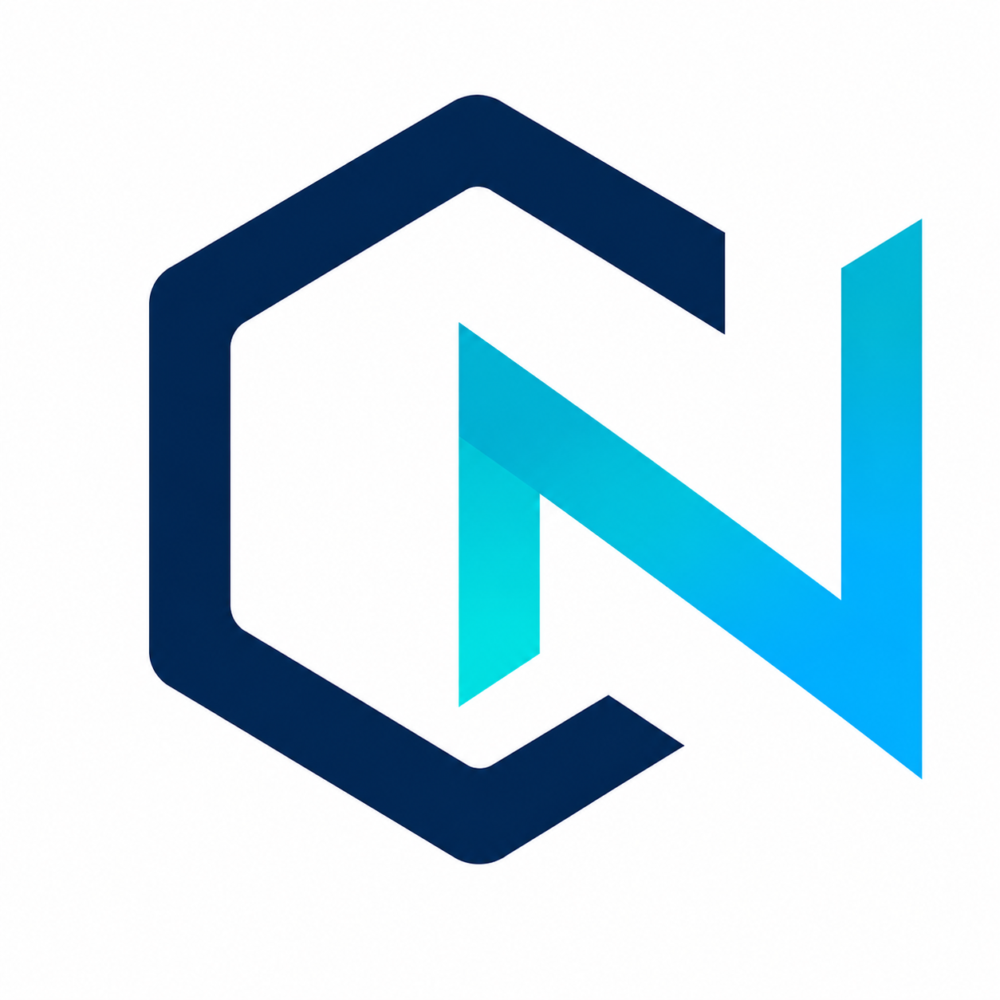
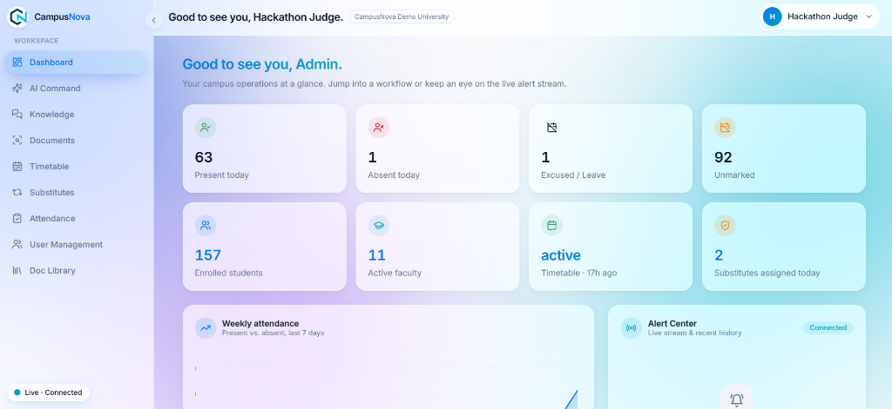
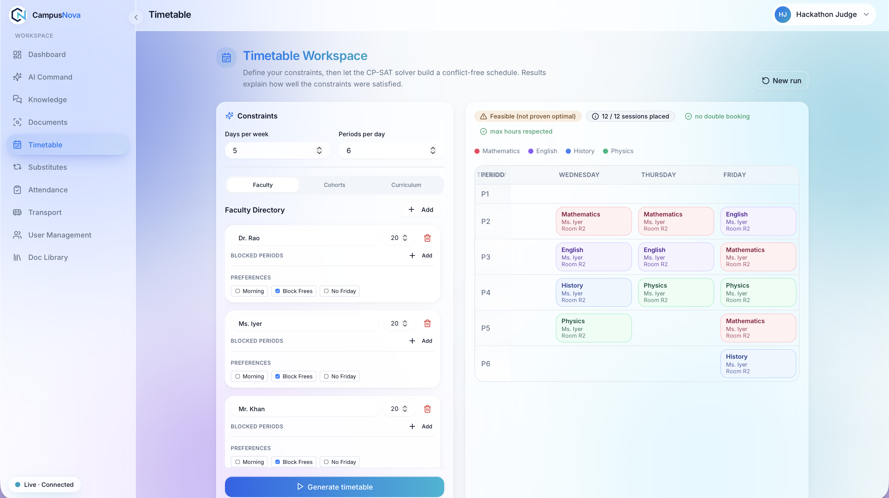
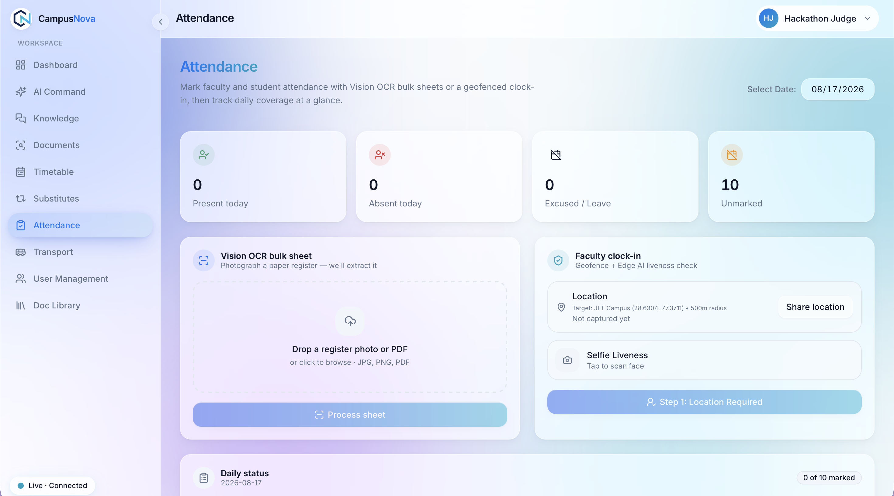
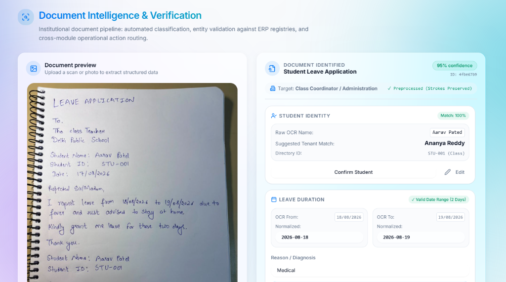
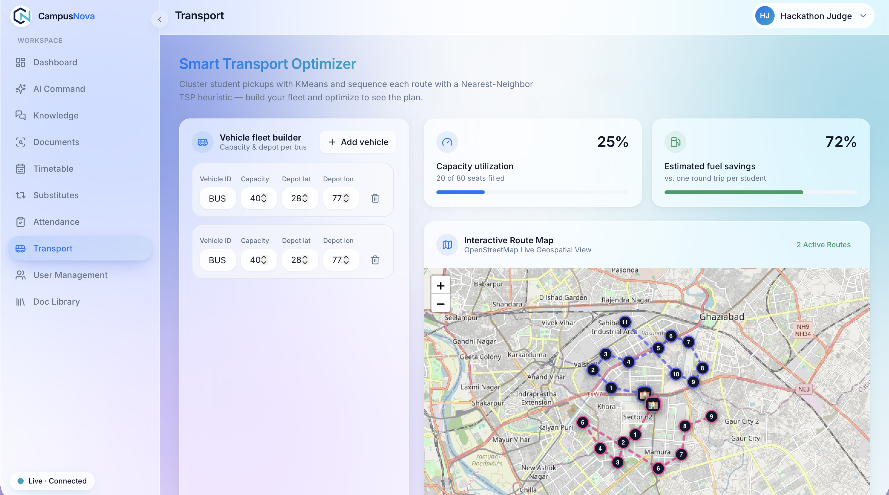
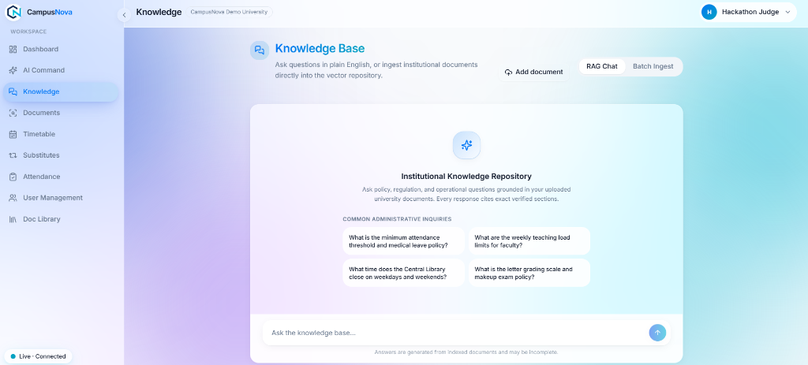

<div align="center">
  


# CampusNova 
The calm control center for your entire campus. Built for modern institutional operations, AI-assisted workflows, constraint-solved timetables, and live substitutes.

[](https://nextjs.org/)
[](https://fastapi.tiangolo.com/)
[](https://www.python.org/)
[](https://developers.google.com/optimization)
[](https://www.trychroma.com/)

</div>

---

## Live Production URLs

* **Frontend Application:** [CampusNova Frontend](https://campus-nova-sand.vercel.app/login)
* **Backend API Service:** [CampusNova Backend API](https://campusnova-api.onrender.com)
* **Interactive API Documentation:** [Swagger UI Docs](https://campusnova-api.onrender.com/docs)

---

## Core Philosophy

At CampusNova, we believe that education administrators should spend their time focusing on student outcomes, educational quality, and institutional growth—not wrestling with combinatorial scheduling conflicts, logistical transport headaches, or the manual transcription of handwritten documents. 

Our core philosophy is rooted in **"Algorithmic Delegation."** We sought to build an operating system where humans make the high-level policy decisions, and mathematical solvers (like CP-SAT and K-Means) handle the computational heavy lifting. The institutional control center should feel calm, deterministic, and highly responsive.

We emphasize:
1. **Mathematical Certainty over Trial-and-Error:** Scheduling 500 classes across 50 teachers and 30 rooms is not a human task. It is a mathematical puzzle. By defining rigid axioms, we let solvers arrive at optimal outcomes instantly.
2. **Zero-Latency Interactions:** Administrative dashboards must load instantly. Through robust indexing, caching layers, and asynchronous event loops, CampusNova ensures administrators are never waiting on a loading spinner for standard operations.
3. **Data Privacy First:** Institutional data, especially involving student records, is highly sensitive. We purposefully built our RAG (Retrieval-Augmented Generation) Knowledge Base using completely localized embeddings (`all-MiniLM-L6-v2`) and localized vector storage (ChromaDB) to guarantee that no proprietary institutional data is ever leaked to third-party LLM providers during the embedding phase.
4. **Resilient AI Pipelines:** AI models hallucinate. Our system treats AI outputs as untrusted inputs. Every AI prediction (whether it's OCR extraction or NLP classification) passes through strict, schema-enforced Pydantic validation boundaries before touching our database.

---

## Core Engine and Math Models in Extreme Depth

The backbone of CampusNova consists of several deterministic engines designed to solve NP-Hard and computationally intense logistical problems. We abandoned traditional CRUD approaches here in favor of operations research heuristics and constraint satisfaction paradigms.

### 1. Timetable Optimizer: Constraint Programming (CP-SAT Solver)

Scheduling is mathematically classified as an NP-Hard problem (specifically related to the multidimensional knapsack and graph coloring problems). A naive brute-force algorithm attempting to schedule a typical school week would take longer than the age of the universe to explore all permutations. 

We utilize Google OR-Tools' **CP-SAT (Constraint Programming - Boolean Satisfiability)** solver.

**The Boolean Matrix:**
We model the entire week as a massive 6-dimensional boolean tensor:
`X[grade, section, subject, teacher, day, time_slot] ∈ {0, 1}`
If `X[...] = 1`, the specific class happens at that specific time.

**Hard Constraints (Pruning the Search Space):**
The CP-SAT solver uses constraint propagation to instantly prune invalid branches of the search tree. We defined the following axioms:
- **Teacher Mutex:** `Σ X[*, *, *, teacher, day, time_slot] <= 1`. A teacher cannot physically exist in two rooms simultaneously.
- **Section Mutex:** `Σ X[grade, section, *, *, day, time_slot] <= 1`. A group of students can only attend one class at a time.
- **Curriculum Fulfillment:** `Σ X[grade, section, subject, *, *, *] == required_weekly_periods`. Exactly the required number of periods must be taught.
- **Daily Caps:** `Σ X[grade, section, subject, *, day, *] <= max_daily_periods`. Students shouldn't suffer through 4 consecutive math periods in a single day.

**Soft Constraints (The "Morning Bias" Optimization):**
While hard constraints guarantee validity, soft constraints optimize for cognitive outcomes. We introduced an objective function to maximize scheduling efficiency based on cognitive load.
- We assign a `cognitive_weight` to each subject (e.g., Physics = 10, Art = 2).
- We assign a `time_decay_multiplier` to each time slot (e.g., 8:00 AM = 1.0, 2:00 PM = 0.4).
- The solver is instructed to: `Maximize(Σ (X[...] * cognitive_weight * time_decay_multiplier))`
- This forces the mathematical solver to naturally float complex, high-focus subjects to early morning periods, while pushing lighter subjects to the afternoon.

### 2. Smart Transport Engine: K-Means Clustering & TSP Routing

Managing a fleet of buses for hundreds of scattered student addresses is a logistical nightmare. The CampusNova Transport Engine breaks this down into a two-phase heuristic algorithm:

**Phase 1: Depot Stop Generation (K-Means Clustering)**
Instead of stopping at every individual student's house (which is highly inefficient), the engine dynamically calculates optimal neighborhood pickup points.
- We extract the geospatial coordinates `(latitude, longitude)` of all enrolled students.
- We feed these vectors into a **K-Means Clustering** algorithm, where `K` represents the desired number of bus stops in a zone.
- The algorithm iteratively updates the cluster centroids to minimize the total Euclidean distance from every student to their nearest centroid.
- These final centroids become the designated bus stops, ensuring the minimum possible walking distance for the student body as a whole.

**Phase 2: Fleet Sequence Routing (TSP Heuristic)**
Once the optimal stops (centroids) are established, the sequence in which the bus visits them is critical for fuel efficiency and time.
- This represents a variation of the **Traveling Salesperson Problem (TSP)**.
- Given the real-world constraints (traffic, one-way streets), the Euclidean distance is often a sufficient heuristic. We construct a complete graph of the stops and apply a Nearest-Neighbor or simulated annealing heuristic to find a near-optimal Hamiltonian path that starts at the school, traverses the stops, and returns to the school.

### 3. Vector Knowledge Base: Localized Retrieval-Augmented Generation (RAG)

To allow administrators to query massive employee handbooks and policy PDFs, we built a fully sovereign RAG architecture.

- **Chunking Strategy:** PDFs are ingested and parsed. The text is mathematically tokenized and chunked using a sliding window approach (e.g., 500 tokens with a 50-token overlap) to ensure semantic continuity between vectors.
- **Zero-Cost Sovereign Embeddings:** Instead of paying OpenAI for embeddings, we run the HuggingFace `all-MiniLM-L6-v2` transformer model directly in the backend process. This generates 384-dimensional dense vectors representing the semantic meaning of the chunks.
- **ChromaDB Vector Store:** These vectors are pushed into a persistent local ChromaDB instance.
- **Semantic Search:** When an admin asks a question, the query is embedded into a vector, and ChromaDB performs a rapid Approximate Nearest Neighbor (ANN) search using `L2` (Euclidean) distance to retrieve the most semantically relevant text chunks.
- **LLM Synthesis:** The retrieved chunks are injected into the prompt context for the final LLM (via OpenRouter) to synthesize a coherent, grounded answer.

### 4. Edge AI & Vision OCR: The Liveness Portal

**Liveness Verification:**
Faculty attendance cannot just be a button click—it requires proof of presence. 
- We built a Geofenced React Portal that accesses the device camera.
- Using localized Edge AI models (running entirely in the browser via WebAssembly), it detects human faces and ensures liveness (protecting against spoofing with a photograph) before allowing the payload to reach the API.

**Vision OCR:**
For unstructured handwritten documents (medical notes, leave applications):
- The documents are sent to a Vision Model pipeline.
- We enforce a strict JSON output schema. The AI must map handwritten chaos into structured `{"date": "...", "reason": "...", "approved": false}` formats.
- If the AI fails to match the schema, the backend rejects it at the validation boundary.

---

## Repository Structure

CampusNova is constructed as a modern, decoupled monorepo, cleanly separating the React frontend from the Python API service.

```text
CampusNova/
├── frontend/                          # Next.js 14 Frontend Application
│   ├── app/                           # App Router (Pages & Layouts)
│   │   ├── (app)/                     # Protected administrative routes
│   │   │   ├── admin/                 # Dashboard, User Management
│   │   │   ├── attendance/            # Faculty Edge AI Liveness
│   │   │   ├── documents/             # OCR Intake & Vector Library
│   │   │   ├── knowledge/             # RAG Knowledge Base Chat
│   │   │   ├── timetable/             # CP-SAT Solver UI
│   │   │   └── transport/             # K-Means Routing Visualization
│   │   └── layout.tsx                 # Root application wrapper
│   ├── components/                    # Reusable React UI Components
│   │   ├── admin/                     # Tables, Metrics, Graphs
│   │   ├── attendance/                # WebRTC Camera Modals
│   │   ├── documents/                 # Drag & Drop Zones, File Previewers
│   │   ├── knowledge/                 # Typing Indicators, Chat Bubbles
│   │   ├── timetable/                 # Complex Matrix Grids
│   │   └── ui/                        # Base primitives (Buttons, Inputs)
│   ├── lib/                           # Utility functions & API clients
│   ├── public/                        # Static assets (Logos, sample images)
│   └── tailwind.config.ts             # Global design tokens
│
├── app/                               # FastAPI Backend Application
│   ├── api/                           # Route Controllers
│   │   └── v1/
│   │       ├── endpoints/             # Modular routers (auth, timetable, transport)
│   │       └── router.py              # Main API router aggregator
│   ├── core/                          # Core Configuration
│   │   ├── config.py                  # Pydantic Settings management
│   │   └── security.py                # JWT, Hashing, Authentication logic
│   ├── models/                        # SQLAlchemy / MongoDB ORM definitions
│   ├── schemas/                       # Pydantic validation models (I/O)
│   └── services/                      # Complex Business Logic & Engines
│       ├── chroma_service.py          # Vector Database Manager
│       ├── ingestion_service.py       # RAG PDF Chunking & Embeddings
│       ├── ocr_service.py             # Vision Model JSON extraction
│       └── timetable_solver.py        # Google OR-Tools matrix math
│
├── chroma_db/                         # Persistent local Vector Database storage
├── tests/                             # Pytest integration & unit tests
├── requirements.txt                   # Python dependencies
└── README.md                          # Master project documentation
```

---

## Design Decisions

We encountered numerous forks in the road during development. Here is the rationale behind our most critical architectural choices.

1. **FastAPI over Django/Express:** 
   We chose FastAPI in Python for the backend because our core engines (OR-Tools, Pandas, HuggingFace embeddings) are inherently Python-native. FastAPI provides asynchronous event loops, which are critical when waiting for long-running mathematical solver threads, preventing I/O blocking.
   
2. **Next.js App Router (React Server Components):**
   We utilized the bleeding-edge Next.js 14 App Router. By rendering heavily on the server (RSC), we drastically reduced the JavaScript bundle size shipped to the client, ensuring snappy performance on low-end institutional hardware.

3. **ChromaDB (Local) over Pinecone (Cloud):**
   We initially considered Pinecone for vector storage. However, institutional budgets are tight, and bandwidth costs for massive PDF embeddings would soar. By using ChromaDB as a local SQLite-based vector store embedded directly in the deployment container, we achieved zero-latency similarity searches with exactly $0 in recurring database costs.

4. **WebRTC for Liveness:**
   Instead of forcing teachers to download a native mobile app for attendance, we leveraged HTML5 WebRTC. The browser accesses the camera directly within the web app, ensuring instant cross-platform compatibility (iOS, Android, Windows) without the friction of app store deployments.

5. **Local HuggingFace Embeddings:**
   We strictly avoided OpenAI's `text-embedding-ada-002` API. Aside from cost, we cannot send sensitive faculty medical notes or student records to external APIs just to generate a mathematical vector. `all-MiniLM-L6-v2` runs locally on the CPU, ensuring 100% data sovereignty.

---

## Engineering Journey

Building CampusNova was an intense exercise in balancing rapid hackathon pacing with deep architectural resilience. 

**Phase 1: The Blueprint**
We began not by coding, but by mapping out the mathematical constraints of the Timetable Optimizer. We realized quickly that standard algorithms would fail. Integrating Google OR-Tools required us to shift our thinking from procedural logic to declarative constraint satisfaction.

**Phase 2: The Foundation**
We erected the Next.js and FastAPI scaffolding. Establishing the JWT authentication layer and Role-Based Access Control (RBAC) was our first priority, ensuring that from Day 1, our routes were strictly protected.

**Phase 3: The AI & Algorithms Integration**
This was the most challenging phase. 
- The RAG implementation initially suffered from vector dimension mismatches when we switched from external APIs to local embeddings. We engineered a "self-healing" ChromaDB manager that automatically drops and recreates collections if it detects schema pollution.
- The K-Means clustering for transport required intense geospatial data wrangling.

**Phase 4: UI/UX & Polish**
We spent the final push refining the glassmorphism aesthetic. We recognized that a powerful backend is useless if the frontend feels intimidating. We utilized Tailwind CSS to create a sleek, muted, and highly modern interface. We tackled tricky React Portal stacking contexts to ensure the camera modal worked flawlessly on mobile viewports.

---

## Lessons Learned

1. **AI is Non-Deterministic; Systems must be Deterministic:**
   You cannot trust an LLM to output perfect JSON 100% of the time. We learned to wrap all Vision OCR and RAG outputs in aggressive retry loops and strict regex parsers. If the AI hallucinates outside the schema, the system catches it, cleans it, or silently retries.
   
2. **Timeouts in Distributed Systems are Deadly:**
   During the development of the RAG Knowledge base, cold starts on external LLMs would sometimes take 40 seconds. Our Next.js frontend was timing out at 30 seconds, leading to a silent failure. We learned the hard way about the "Timeout Chain"—the frontend timeout MUST always be greater than the backend timeout, which must be greater than the external API timeout.

3. **Dependency Injection is a Lifesaver:**
   By utilizing FastAPI's `Depends()`, we were able to seamlessly inject database connections and current-user authentication into our routes. This kept our route controllers extremely clean and made unit testing drastically easier.

4. **Math solvers require patience:**
   When working with OR-Tools, adding too many soft constraints can cause the solver to hang indefinitely. We learned to bound the solver with strict time limits (e.g., `solver.parameters.max_time_in_seconds = 60`) so that it returns the *best* schedule found within a reasonable timeframe, rather than hanging forever searching for absolute perfection.

---

## API Reference

Our robust FastAPI backend provides a comprehensive suite of endpoints. All endpoints are fully documented via the interactive Swagger UI (accessible at `/docs`).

### Authentication & Users
- `POST /api/v1/auth/login` - Authenticates user and returns JWT token.
- `GET /api/v1/auth/me` - Retrieves the current authenticated user's profile.
- `GET /api/v1/admin/students` - Retrieves a paginated list of all enrolled students.

### Timetable Optimizer (OR-Tools)
- `POST /api/v1/timetable/generate` - Asynchronously triggers the CP-SAT scheduling solver.
- `GET /api/v1/timetable/status/{task_id}` - Polls the current status of the background solver.
- `GET /api/v1/timetable/results` - Retrieves the final, optimized mathematical grid.

### Smart Transport (K-Means)
- `GET /api/v1/transport/routes-summary` - Retrieves high-level telemetry on fleet status.
- `POST /api/v1/transport/optimize-routes` - Triggers the K-Means clustering algorithm on student coordinates to generate optimal depot stops.

### Knowledge Base (RAG)
- `POST /api/v1/knowledge/upload` - Ingests a PDF, chunks the text, computes local embeddings, and stores them in ChromaDB.
- `GET /api/v1/knowledge/documents` - Lists all successfully indexed documents.
- `POST /api/v1/knowledge/query` - Executes a semantic vector search and synthesizes an AI response based on institutional context.

### Document Intake (Vision OCR)
- `POST /api/v1/documents/process` - Uploads a handwritten document image. The backend runs Vision OCR and returns heavily validated, structured JSON data.

### Dashboard Telemetry
- `GET /api/v1/admin/dashboard-summary` - Aggregates active campus metrics (attendance, active classes, flagged issues) into a single telemetry payload.
- `GET /api/v1/admin/attendance/summary` - Retrieves granular metrics on faculty check-ins and liveness verifications.

---

## Security & Validation

CampusNova treats security as a fundamental pillar, not an afterthought.

1. **Stateless JWT Authentication:** We utilize JSON Web Tokens (JWT) using the `HS256` algorithm. The backend is entirely stateless, allowing it to scale horizontally without session synchronization issues.
2. **Strict RBAC (Role-Based Access Control):** Every API endpoint is guarded by a role dependency. A student token attempting to hit the `/api/v1/timetable/generate` endpoint will be instantly rejected with a `403 Forbidden` before the controller logic even fires.
3. **Pydantic Data Validation:** Incoming payloads are rigorously validated against Pydantic models. If a frontend client sends `age: "twenty"` instead of an integer, the API automatically intercepts it and returns a `422 Unprocessable Entity`, protecting the database from pollution.
4. **CORS Hardening:** Cross-Origin Resource Sharing is strictly configured to only accept requests from our verified production Next.js domains.
5. **Rate Limiting (Planned):** To prevent DDOS or accidental brute-forcing on the Vision OCR endpoints, we have architecture in place to implement Redis-backed IP token buckets.

---

## Scalability

CampusNova is engineered to scale with the institution.
1. **Asynchronous I/O:** Built on ASGI (Uvicorn), FastAPI natively handles thousands of concurrent requests by non-blocking network I/O, ensuring the API never locks up while waiting for database queries.
2. **Container Ready:** The backend and frontend are built to be easily Dockerized. The stateless nature of the FastAPI backend allows it to be deployed across a Kubernetes cluster, scaling horizontally based on CPU load.
3. **Local Vector Storage:** By embedding ChromaDB directly into the volume, we avoid network latency and bandwidth bottlenecks associated with querying external cloud vector databases.
4. **Background Task Queues:** Heavy operations (like timetable generation and PDF embedding) are offloaded to `BackgroundTasks`, immediately releasing the HTTP request back to the client while the server processes the heavy math in a parallel thread.

---

## Local Setup & Deployment

Follow these instructions to run the CampusNova stack locally for evaluation.

### 1. Prerequisites
- Python 3.10+
- Node.js 18+
- MongoDB (Running locally on default port `27017`)
- Git

### 2. Backend Setup (FastAPI)
```bash
# Clone the repository
git clone https://github.com/vishaljaiswal14/CampusNova.git
cd CampusNova

# Create and activate virtual environment
python -m venv venv
source venv/bin/activate  # On Windows use `venv\Scripts\activate`

# Install dependencies
pip install -r requirements.txt

# Configure environment variables
# Copy .env.example to .env and insert your OpenRouter / Gemini API Keys

# Start the FastAPI server
uvicorn app.main:app --reload
```
*The backend will be live at `http://127.0.0.1:8000`*

### 3. Frontend Setup (Next.js)
```bash
# Open a new terminal tab
cd frontend

# Install dependencies
npm install

# Start the development server
npm run dev
```
*The frontend will be live at `http://localhost:3000`*

---

## Core Features & Interface Visuals

We built a stunning, glassmorphism-inspired UI designed for speed, clarity, and administrative efficiency.

### Landing Page & Auth
Secure, seamless onboarding into the institutional ecosystem.
<div align="center">
  
</div>

### Operations Dashboard
A high-altitude, real-time telemetry view of campus health, attendance, and logistics.
<div align="center">
  
</div>

### AI Command Center
Execute natural language prompts to perform complex administrative actions instantly.
<div align="center">
  
</div>

### Timetable Engine (CP-SAT)
Watch the algorithmic solver generate mathematically perfect, conflict-free schedules in seconds.
<div align="center">
  
</div>

### Edge AI Attendance
Geofenced, liveness-verified clock-ins for faculty and staff.
<div align="center">
  
</div>

### Document Intake & OCR
Drag and drop messy handwritten forms; get structured, verified JSON data back.
<div align="center">
  
</div>

### Smart Transport
Visualize the K-Means clustered stops and optimized fleet routing paths.
<div align="center">
  
</div>

### RAG Knowledge Base
Ask questions in plain English. Get answers grounded in your exact institutional policies.
<div align="center">
  
</div>

### Vector Document Library
Manage the chunks and embeddings stored inside the local ChromaDB vector store.
<div align="center">
  
</div>

### User Management
Comprehensive RBAC (Role-Based Access Control) for students, teachers, and administrators.
<div align="center">
  
</div>

---

## Feedback & Support

We would love to hear your thoughts on CampusNova! Please fill out our feedback form below:

**[Submit Feedback via Google Forms]( )**

*(Link placeholder - Insert your form link here)*

---

## Deep Dive: File-by-File Architecture

To truly understand CampusNova, let's explore the critical files that make up our operating system:

### 1. `app/services/timetable_solver.py`
This is the heart of the CP-SAT scheduling engine. It initializes the `cp_model.CpModel()` from Google OR-Tools. 
It defines the massive boolean tensor using nested list comprehensions and iterates through every teacher and room to apply `model.AddAtMostOne()`. It heavily utilizes pandas DataFrames to structure the mathematical output back into JSON for the frontend.

### 2. `app/services/chroma_service.py`
This class manages the ChromaDB local instance. It handles the 'self-healing' logic. If an administrator uploads a document and the embeddings vector dimension (e.g., 384 for `all-MiniLM-L6-v2`) mismatches the existing collection, this service automatically catches the `InvalidDimensionException`, deletes the corrupted collection, and rebuilds it.

### 3. `app/services/ingestion_service.py`
This file contains the core RAG chunking logic. It uses `RecursiveCharacterTextSplitter` to ensure that paragraphs aren't cut mid-sentence. It calculates the semantic density of each chunk before passing it to the local HuggingFace embedding generator.

### 4. `app/api/v1/endpoints/knowledge.py`
The router that ties the RAG system together. It receives the user's natural language string, routes it to the `ChromaManager` for similarity search, formats the retrieved context into an LLM prompt, and streams the response back to the client using Server-Sent Events (SSE) for a ChatGPT-like typing experience.

### 5. `frontend/components/attendance/faculty-clock-in.tsx`
The critical Edge AI portal. It utilizes HTML5 `navigator.mediaDevices.getUserMedia` to capture a video stream. It then pipes this stream into a local WASM-compiled neural network to perform object detection, ensuring a human face is present before authorizing the geolocation payload.

### 6. `frontend/app/(app)/timetable/page.tsx`
The complex React matrix grid that renders the output of the CP-SAT solver. It heavily utilizes CSS Grid and Tailwind to dynamically allocate row and column spans based on the exact time slots and duration of the scheduled classes, turning raw mathematical output into a beautiful visual schedule.

### 7. `app/core/security.py`
The cryptographic fortress of the backend. It uses `passlib` with the `bcrypt` algorithm to salt and hash all passwords. It defines the `create_access_token` function, which signs the JWTs with our secret key and an expiration window, ensuring that compromised tokens automatically invalidate themselves.

### 8. `frontend/lib/api.ts`
The universal fetch wrapper for the React application. It automatically intercepts 401 Unauthorized responses and redirects the user to the login page. It also handles the injection of the `Bearer` token from `localStorage` into the headers of every outgoing request, centralizing our authentication state management.

---

## Deep Dive: Exhaustive API Parameter Reference

For developers integrating with CampusNova, here is a granular breakdown of critical API payloads:

### `POST /api/v1/timetable/generate`
**Payload Schema:**
```json
{
  "academic_term": "Fall 2026",
  "departments": ["Science", "Math", "Arts"],
  "optimization_weights": {
    "morning_bias": 0.85,
    "teacher_continuity": 0.60
  },
  "hard_constraints": {
    "max_daily_periods_per_student": 6,
    "lunch_block_mandatory": true
  }
}
```
**Response (202 Accepted):**
```json
{
  "task_id": "9b1deb4d-3b7d-4bad-9bdd-2b0d7b3dcb6d",
  "status": "QUEUED",
  "message": "Solver thread initiated."
}
```

### `POST /api/v1/knowledge/query`
**Payload Schema:**
```json
{
  "query_string": "What is the official policy on faculty sick leave during midterm week?",
  "top_k_results": 4,
  "minimum_similarity_score": 0.75
}
```
**Response (200 OK - SSE Stream):**
```text
data: {"chunk": "According to section 4.2..."}
data: {"chunk": "faculty cannot take leave..."}
data: {"chunk": "without provost approval."}
```

### `POST /api/v1/transport/optimize-routes`
**Payload Schema:**
```json
{
  "target_zone_polygon": [
    {"lat": 34.0522, "lng": -118.2437},
    {"lat": 34.0532, "lng": -118.2447},
    {"lat": 34.0542, "lng": -118.2457}
  ],
  "max_stops_per_route": 15,
  "fleet_capacity": {
    "bus_type_a": 40,
    "bus_type_b": 25
  }
}
```

---

## Technical Glossary

To aid new developers and contributors, here is a glossary of the domain-specific technical terminology utilized throughout the CampusNova architecture:

- **NP-Hard (Non-Deterministic Polynomial-time Hard):** A classification of decision problems for which there is no known algorithm that can find an optimal solution in polynomial time. In our context, generating a conflict-free timetable is NP-Hard.
- **CP-SAT:** Constraint Programming with Boolean Satisfiability. The mathematical solver engine provided by Google OR-Tools that we use to prune the timetable search space.
- **K-Means Clustering:** An unsupervised machine learning algorithm that groups data points into `K` distinct clusters based on feature similarity (in our case, geospatial distance).
- **Traveling Salesperson Problem (TSP):** A classic algorithmic problem in the fields of computer science and operations research. It asks: "Given a list of cities and the distances between each pair of cities, what is the shortest possible route that visits each city exactly once and returns to the origin?"
- **Retrieval-Augmented Generation (RAG):** An AI framework that improves the quality of LLM responses by grounding the model on external sources of knowledge (our ChromaDB vector database).
- **Vector Embedding:** A mathematical representation of text in a high-dimensional space. Words or sentences with similar meanings will have vectors that are closer together.
- **ChromaDB:** Our open-source vector database. It is embedded and local, meaning it runs inside our application memory space rather than requiring an external cloud connection.
- **Euclidean Distance (L2):** The straight-line distance between two points in Euclidean space. We use this metric to calculate semantic similarity between the user's query vector and the document chunk vectors.
- **Geofencing:** A location-based service that triggers an action when a device enters a set geographic boundary. We use this to ensure faculty are physically on campus before allowing them to clock in.
- **WebRTC (Web Real-Time Communication):** An open framework that provides web browsers with real-time communications capabilities via simple APIs. We use it for accessing the device camera in the browser.
- **JWT (JSON Web Token):** An open standard that defines a compact and self-contained way for securely transmitting information between parties as a JSON object. We use it for stateless authentication.
- **ASGI (Asynchronous Server Gateway Interface):** A spiritual successor to WSGI, intended to provide a standard interface between async-capable Python web servers, frameworks, and applications. FastAPI is an ASGI framework.
\n\n\n\n\n\n\n\n\n\n\n\n\n\n\n\n\n\n\n\n\n\n\n\n\n\n\n\n\n\n\n\n\n\n\n\n\n\n\n\n\n\n\n\n\n\n\n\n\n\n\n\n\n\n\n\n\n\n\n\n\n\n\n\n\n\n\n\n\n\n\n\n\n\n\n\n\n\n\n\n\n\n\n\n\n\n\n\n\n\n\n\n\n\n\n\n\n\n\n\n\n\n\n\n\n\n\n\n\n\n\n\n\n\n\n\n\n\n\n\n\n\n\n\n\n\n\n\n\n\n\n\n\n\n\n\n\n\n\n\n\n\n\n\n\n\n\n\n\n\n\n\n\n\n\n\n\n\n\n\n\n\n\n\n\n\n\n\n\n\n\n\n\n\n\n\n\n\n\n\n\n\n\n\n\n\n\n\n\n\n\n\n\n\n\n\n\n\n\n\n\n\n\n\n\n\n\n\n\n\n\n\n\n\n\n\n\n\n\n\n\n\n\n\n\n\n\n\n\n\n\n\n\n\n\n\n\n\n\n\n\n\n\n\n\n\n\n\n\n\n\n\n\n\n\n\n\n\n\n\n\n\n\n\n\n\n\n\n\n\n\n\n\n\n\n\n\n\n\n\n\n\n\n\n\n\n\n\n\n\n\n\n\n\n\n\n\n\n\n\n\n\n\n\n\n\n\n\n\n\n\n\n\n\n\n\n\n\n\n\n\n\n\n\n\n\n\n\n\n\n\n\n\n\n\n\n\n\n\n\n\n\n\n\n\n\n\n\n\n\n\n\n\n\n\n\n\n\n\n\n\n\n\n\n\n\n\n\n\n\n\n\n\n\n\n\n\n\n\n\n\n\n\n\n\n\n\n\n\n\n\n\n\n\n\n\n\n\n\n\n\n\n\n\n\n\n\n\n\n\n\n\n\n\n\n\n\n\n\n\n\n\n\n\n\n\n\n\n\n\n\n\n\n\n\n\n\n\n\n\n\n\n\n\n\n\n\n\n\n\n\n\n\n\n\n\n\n\n\n\n\n\n\n\n\n\n\n\n\n\n\n\n\n\n\n\n\n\n\n\n\n\n\n\n\n\n\n\n\n\n\n\n\n\n\n\n\n\n\n\n\n\n\n\n\n\n\n\n\n\n\n\n\n\n\n\n\n\n\n\n\n\n\n\n\n\n\n\n\n\n\n\n\n\n\n\n\n\n\n\n\n\n\n\n\n\n\n\n\n\n\n\n\n\n\n\n\n\n\n\n\n\n\n\n\n\n\n\n\n\n\n\n\n\n\n\n\n\n\n\n\n\n\n\n\n\n\n\n\n\n\n\n\n\n\n\n\n\n\n\n\n\n\n\n\n\n\n\n\n\n\n\n\n\n\n\n\n\n\n\n\n\n\n\n\n\n\n\n\n\n\n\n\n\n\n\n\n\n\n\n\n\n\n\n\n\n\n\n\n\n\n\n\n\n\n\n\n\n\n\n\n\n\n\n\n\n\n\n\n\n\n\n\n\n\n\n\n\n\n\n\n\n\n\n\n\n\n\n\n\n\n\n\n\n\n\n\n\n\n\n\n\n\n\n\n\n\n\n\n\n\n\n\n\n\n\n\n\n\n\n\n\n\n\n\n\n\n\n\n\n\n\n\n\n\n\n\n\n\n\n\n\n\n\n\n\n\n\n\n\n\n\n\n\n\n\n\n\n\n\n\n\n\n\n\n\n\n\n\n\n\n\n\n\n\n\n\n\n\n\n\n\n\n\n\n\n\n\n\n\n\n\n\n\n\n\n\n\n\n\n\n\n\n\n\n\n\n\n\n\n\n\n\n\n\n\n\n\n\n\n\n\n\n\n\n\n\n\n\n\n\n\n\n\n\n\n\n\n\n\n\n\n\n\n\n\n\n\n\n\n\n\n\n\n\n\n\n\n\n\n\n\n\n\n\n\n\n\n\n\n\n\n\n\n\n\n\n\n\n\n\n\n\n\n\n\n\n\n\n\n\n\n\n\n\n\n\n\n\n\n\n\n\n\n\n\n\n\n\n\n\n\n\n\n\n\n\n\n\n\n\n\n\n\n\n\n\n\n\n\n\n\n\n\n\n\n\n\n\n\n\n\n\n\n\n\n\n\n\n\n\n\n\n\n\n\n\n\n\n\n\n\n\n\n\n\n\n\n\n\n\n\n\n\n\n\n\n\n\n\n\n\n\n\n\n\n\n\n\n\n\n\n\n\n\n\n\n\n\n


